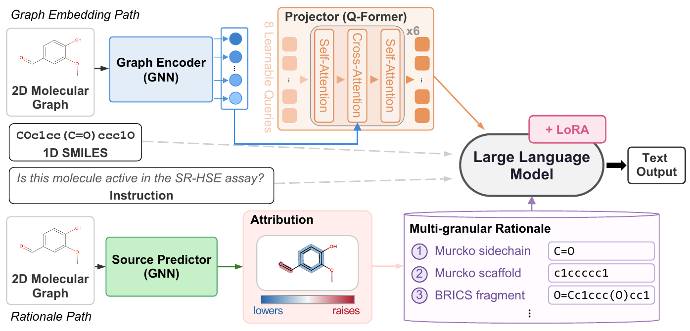

# MR-MoL: Multi-Granular Rationale-Guided Molecular LLM for Property Prediction

**Authors:** Junwoo Park, Minyoung Shin, Cheol Soon Lee, Sujee Lee
**Preprint:** [arXiv:2608.10480](https://arxiv.org/abs/2608.10480)
**Contact:** jw0528@g.skku.edu

<p align="center">
  
</p>

MR-MoL is a molecular LLM that feeds GNN-derived substructure attributions to the
model as textual evidence.

**Scope.** This repository trains and evaluates the main model and regenerates
its rationale data from source. The rationale diagnostics reported in the paper
are not included here; they are available from the authors on request.

## Setup

```bash
uv sync                            # pinned dependencies into .venv
bash download/download_molebert.sh # Mole-BERT sources + pretrained GIN -> rationale/molebert/
bash download/download_molca.sh    # MolCA Stage-1 weights -> checkpoints/molca/stage1.ckpt
hf auth login                      # for gated meta-llama/Llama-3.1-8B-Instruct
```

Dependency management uses [uv](https://docs.astral.sh/uv/); exact versions are
pinned in `uv.lock`. The main libraries are PyTorch 2.11, Transformers 4.57,
PEFT 0.19, RDKit 2026.03, and PyTorch Geometric 2.7 on Python 3.12 and CUDA 12.8.

Nothing third-party is redistributed here. The setup steps fetch Mole-BERT (its
GIN code and pretrained weights, used by the rationale pipeline), the MolCA
Stage-1 weights that initialize the GIN encoder and Q-Former, and
Llama-3.1-8B-Instruct, which is gated and needs an access request. The trained
MR-MoL weights are our own and are released separately (see below).

## Data

All data is on Hugging Face at
[`junwoo00/MR-MoL`](https://huggingface.co/datasets/junwoo00/MR-MoL). The dataset
repo mirrors this project's layout, so one download puts every file where the
code looks for it:

```bash
hf download junwoo00/MR-MoL --repo-type dataset \
    --include "data_prep/*" "rationale/*" --local-dir .
```

| | train / valid / test | path |
|---|---|---|
| Stage 1 alignment corpus | 89,919 | `data_prep/stage1/train.json` |
| Stage 2 instruction data | 136,670 / 16,306 / 16,210 | `data_prep/stage2/{train,valid,test}/` |
| Rationale-augmented Stage 2 | 136,670 / 16,306 / 16,210 | `rationale/format/generated/<task>/rationale/<split>/` |

The rationale-augmented data is the exact input behind the reported numbers, so
with it you can train or evaluate without touching the GNN pipeline. The steps
below regenerate it from source instead; they need a GPU.

### Rationale generation

The rationale comes from Mole-BERT, each trained three times.

```bash
# 1. Finetune the source predictors (3 seeds per task)
uv run python rationale/attribution/run_finetune.py --task all --device 0
# 2. Substructure-masking attribution
uv run python rationale/attribution/run_pipeline.py --task all --device 0
# 3. Serialize into rationale-augmented Stage 2 data
uv run python rationale/format/generate_rationale.py --task all --all-templates \
    --attribution-dir rationale/attribution/output \
    --output-dir rationale/format/generated
```

## Pretrained checkpoints

Trained weights are on Hugging Face at
[`junwoo00/MR-MoL`](https://huggingface.co/junwoo00/MR-MoL). Download them into
the paths the configs already point at:

```bash
hf download junwoo00/MR-MoL stage1_epoch10.pt --local-dir checkpoints/trained/stage1
hf download junwoo00/MR-MoL final.pt         --local-dir experiments/stage2
```

```
checkpoints/trained/stage1/stage1_epoch10.pt   Stage 1, the graph-language alignment (400 MB)
experiments/stage2/final.pt                    Stage 2, the trained MR-MoL (447 MB)
```

`final.pt` holds the Q-Former projector and the LoRA adapters — the GIN encoder is frozen in Stage 2, so it is read from `stage1_epoch10.pt`. 
**Both files are needed to evaluate.**

With both in place you can evaluate without training:

```bash
uv run python scripts/property_prediction/run_stage2.py --config configs/stage2.yaml --eval-only
```

## Training

```bash
# Stage 1: graph-language alignment. Checkpoints are scored on the held-out
# ChEBI-20 test split; the reported runs start Stage 2 from epoch 10.
uv run python scripts/property_prediction/train_stage1.py --config configs/stage1.yaml

# Stage 2: rationale-guided instruction tuning, then evaluation.
uv run python scripts/property_prediction/run_stage2.py --config configs/stage2.yaml
```

## Citation

```bibtex
@article{park2026multi,
  title={Multi-Granular Rationale-Guided Molecular LLM for Property Prediction},
  author={Park, Junwoo and Shin, Minyoung and Lee, Cheol Soon and Lee, Sujee},
  journal={arXiv preprint arXiv:2608.10480},
  year={2026}
}
```

## License

Apache License 2.0 — see [`LICENSE`](LICENSE).

That license covers the code written for this project. [`NOTICE`](NOTICE) credits
the third-party work this builds on, and every file carrying third-party code
says so at the top.

## Acknowledgements

This work builds on MolCA (Liu et al., EMNLP 2023), Mole-BERT (Xia et al.,
ICLR 2023), SME (Wu et al., Nature Communications 2023), and BLIP-2 / LAVIS
(Li et al., ICML 2023). See [`NOTICE`](NOTICE) for what each contributed.
